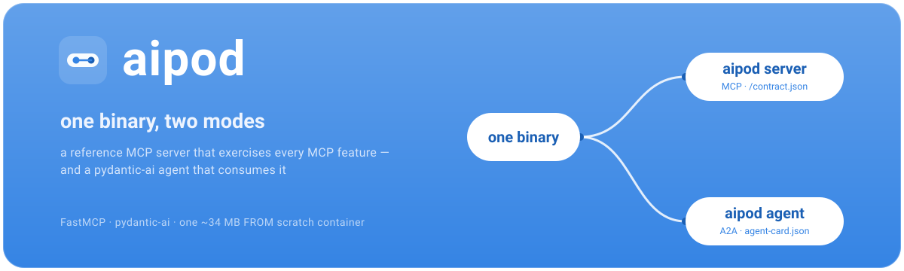
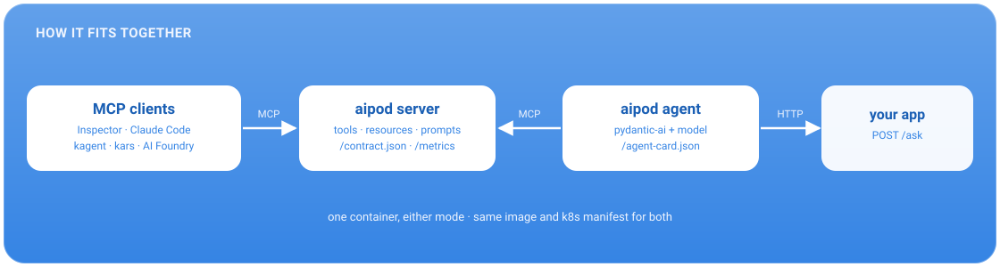
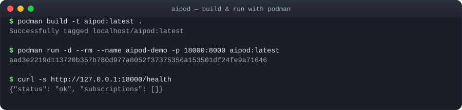
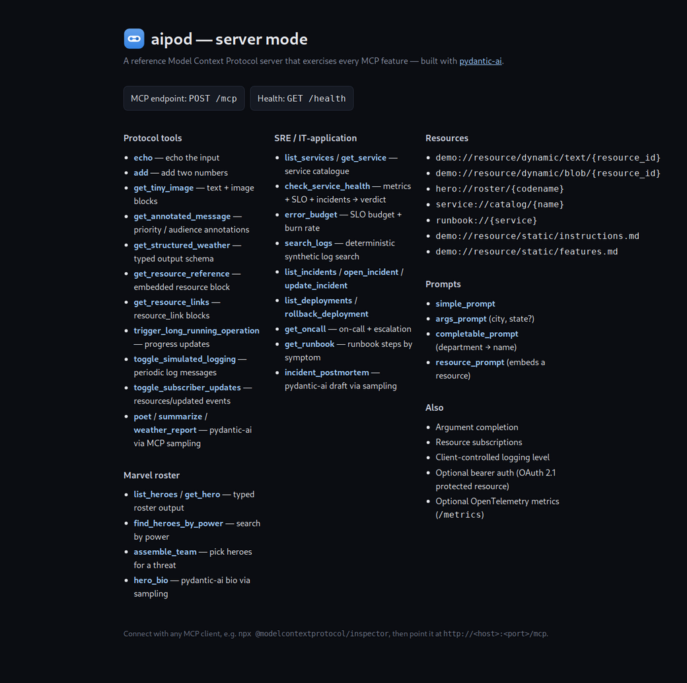
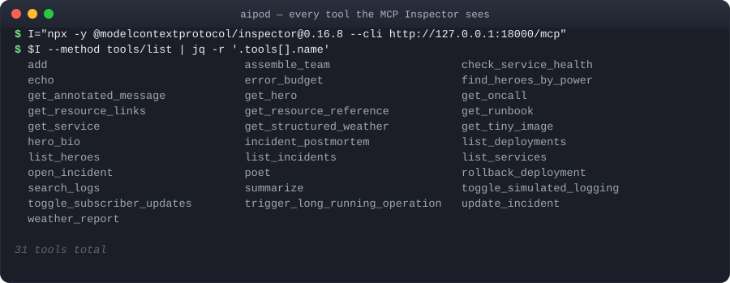
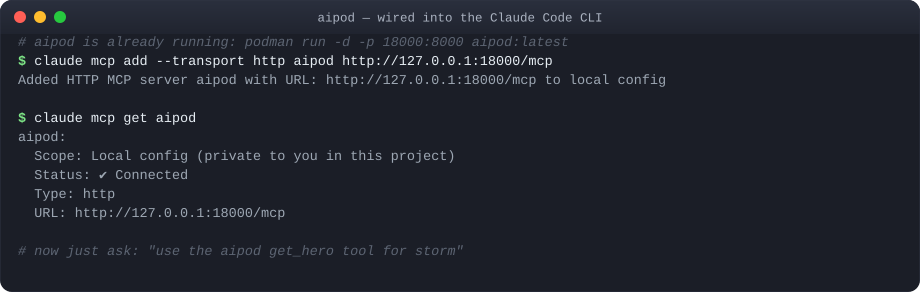
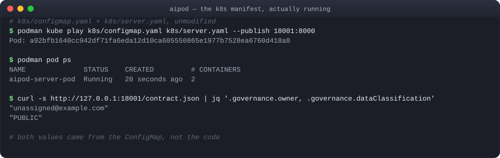
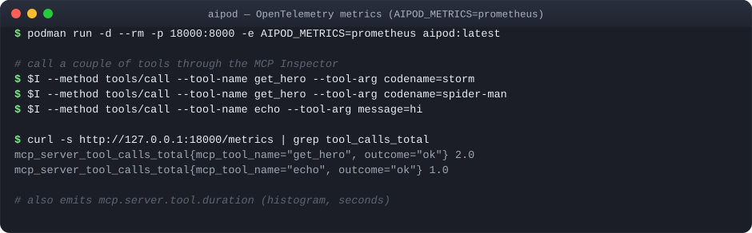

# Why I built a fake MCP server on purpose



*Notes from a Solution Architect for AI, coming out of SRE and platform
engineering.*

---

## The problem

I design the plumbing that other people's AI agents run on: gateways, routers,
CI checks. That plumbing needs something real to test against.

Testing against production is risky. A quick hand-written stub only covers
the one call you needed last week. Waiting for a "real" server from another
team blocks your work on their schedule.

So I built `aipod`: an MCP server that deliberately implements every MCP
feature, in one place, for testing against.

## What you can test with it

One server, one endpoint, and it covers the ground that usually takes three
different test targets:

- **The MCP protocol itself** — tools, structured output, resources (static
  and templated), prompts, argument completion, subscriptions, progress,
  logging levels.
- **Auth** — turn on a bearer token and the same endpoint becomes an OAuth 2.1
  protected resource, metadata document included.
- **Sampling** — tools that ask the *caller's* model to do the work, so you
  can test that handshake without owning a model key.
- **Side effects and state** — a toy incident/deployment system with tools
  that actually mutate state, so a policy engine has something real to gate.
- **Agent cards and service contracts** — both published straight from the
  running code, so a registry, gateway, or SDK generator has a real document
  to develop against.
- **Metrics** — OpenTelemetry counters and histograms per tool call, so your
  observability pipeline has something to scrape before it meets production.
- **Deployment** — the same container and Kubernetes manifests you'd actually
  ship, not a snippet in a README.

Each of those gets its own section below, with the exact commands.

## What it is

One program, two modes:

- **`aipod server`** — a reference MCP server. Tools, resources, prompts,
  auth, the works. Nothing it does matters for a business — it exists purely
  to be tested against.
- **`aipod agent`** — a small agent that calls `aipod server`, so you have a
  real client to test with too.



## Two documents worth knowing

Every agent and every server should be able to describe itself. `aipod`
publishes both of the documents that do that:

- **Agent card** — a short JSON file at `/.well-known/agent-card.json` that
  says "here's an agent, here's what it can do, here's how to reach it."
  Small and stable, meant for a registry or a router to read.
- **Service contract** — a longer JSON file at `/contract.json` listing every
  tool's exact input and output shape. Meant for generating a typed client,
  validating a call before it's sent, or diffing in CI when something
  changes.

Card answers *which* agent. Contract answers *exactly how to call it*. You
want both, generated from the running code, not hand-written.

The contract also carries a `security` block, and it's backed by a real
endpoint: turn on auth and `GET /.well-known/oauth-protected-resource` starts
serving the OAuth 2.1 metadata a client needs to authenticate — so "how do I
call this" and "how do I authenticate to call this" come from the same
running server, not a separate wiki page.

## See it run

```bash
podman build -t aipod:latest .
podman run -d --rm -p 18000:8000 aipod:latest
curl -s http://127.0.0.1:18000/health
```



Open `http://127.0.0.1:18000/` in a browser and there's a plain landing page
listing everything the server has — no MCP client needed to see what's there:



## Every tool, from a real MCP client

The [MCP Inspector](https://github.com/modelcontextprotocol/inspector) is the
reference MCP client. Point it at the running container and ask what's there
— no model, no API key needed:

```bash
I="npx -y @modelcontextprotocol/inspector@0.16.8 --cli http://127.0.0.1:18000/mcp"
$I --method tools/list | jq -r '.tools[].name'
```



That's the whole surface: plain tools, a toy hero roster, a toy SRE/incident
system, and a few tools that borrow the caller's model via MCP sampling.
Real enough to catch real bugs in a gateway or a client, without touching
anything that matters.

## Use it from Claude Code

`aipod server` is an MCP server, so any MCP client can use it — including
Claude Code's own CLI. Point it at the running container:

```bash
claude mcp add --transport http aipod http://127.0.0.1:18000/mcp
claude mcp get aipod
```



From there, just ask Claude to use one of aipod's tools — `get_hero`,
`check_service_health`, whatever's listed above. Same command works against
a remote agent too: swap the URL for wherever `aipod server` is actually
deployed (the k8s `Service` below, for instance) and nothing else changes.

## The same manifest, on Kubernetes

`aipod` ships the actual Kubernetes files it runs on — a `Deployment`, a
`Service`, a `ConfigMap`. Below, that `ConfigMap` and `Deployment` are started
unmodified with `podman kube play` (runs a Kubernetes manifest directly,
handy for a quick check without a cluster):

```bash
podman kube play k8s/configmap.yaml k8s/server.yaml --publish 18001:8000
podman pod ps
curl -s http://127.0.0.1:18001/contract.json | jq '.governance.owner, .governance.dataClassification'
```



`owner` and `dataClassification` came from the `ConfigMap`, not the code.
Change the manifest, and the document the server publishes changes with it —
which is what makes it something a reviewer can actually trust.

The same `k8s/` manifests are what you'd run on a real cluster — nothing
Azure-specific needed beyond building the image somewhere AKS can pull it
from (shape below, not applied here — no Azure subscription in this
environment):

```bash
az acr create -g my-rg -n myacr --sku Basic
az acr build -r myacr -t aipod:latest .          # builds in ACR, no local push needed

az aks create -g my-rg -n my-aks --attach-acr myacr
az aks get-credentials -g my-rg -n my-aks

# point k8s/kustomization.yaml's `images:` entry at myacr.azurecr.io/aipod, then:
kubectl apply -k k8s/
```

`--attach-acr` is the part worth knowing — it wires AKS's kubelet identity to
pull from that registry without a separate `imagePullSecret`.

## Wiring it into an agent platform

Same server, same `/mcp` endpoint — different agent runtimes just point at
it differently. Three examples (shapes below, not applied to any cluster):

**[kagent](https://kagent.dev)** — a Kubernetes-native agent framework —
registers a remote MCP server as its own CRD. Point one at the `Service`
from the manifest above:

```yaml
apiVersion: kagent.dev/v1alpha3
kind: RemoteMCPServer
metadata:
  name: aipod
  namespace: kagent
spec:
  description: aipod reference MCP server
  protocol: STREAMABLE_HTTP
  url: http://aipod-server.default.svc.cluster.local:80/mcp
  timeout: 30s
```

Apply it and kagent discovers all 31 tools the same way it discovers its own
built-in tool server — `kubectl get remotemcpserver aipod -o yaml` shows them
under `status.discoveredTools` once accepted.

**[kars](https://github.com/Azure/kars)** — Microsoft's Kubernetes-native
agent runtime, one hardened sandbox per agent — has its own `McpServer` CRD,
with OAuth and per-tool allow-lists built in:

```yaml
apiVersion: kars.azure.com/v1alpha1
kind: McpServer
metadata:
  name: aipod
  namespace: kars-my-agent
spec:
  url: http://aipod-server.default.svc.cluster.local:80/mcp
  allowedTools: ["*"]
```

`aipod` runs open by default, so no `oauth` block is needed above; if it's
started with `AIPOD_AUTH_ISSUER` pointed at a real authorization server, add
`productionMode: true` and an `oauth` block matching that issuer.

**Azure AI Foundry** (and anything else using the same Responses-API-shaped
MCP tool) takes the endpoint straight in the agent/tool definition — no
separate resource, no CRD:

```jsonc
{
  "type": "mcp",
  "server_label": "aipod",
  "server_url": "https://aipod.example.com/mcp",
  "require_approval": "never"
}
```

Either way, the interesting part isn't the wiring — it's that whatever
you register, `aipod` gives you a real, fully-featured server to check that
wiring against before you point it at something that matters.

## Metrics, for free

Testing a gateway or a router is only half the job — you also need to know
whether *your* pipeline can actually see what's happening inside the thing
it's talking to. `aipod` ships OpenTelemetry metrics: per-tool call counts and
durations, off by default, one env var to turn on.

```bash
podman run -d --rm -p 18000:8000 -e AIPOD_METRICS=prometheus aipod:latest
# call a couple of tools, then:
curl -s http://127.0.0.1:18000/metrics | grep tool_calls_total
```



`AIPOD_METRICS` also takes `otlp` (push to a collector) or `console` (dump to
stdout) — same instruments either way:
`mcp.server.tool.calls`, `mcp.server.tool.duration`, and the agent-side
`aipod.agent.ask.calls` / `.duration`. Point your existing OTel pipeline at it
before you point it at a real fleet.

## Why it's worth having

A test fixture that only covers what one team happened to need isn't
infrastructure — it's a blind spot with a URL. `aipod` refuses to be partial:
every gateway, router, or CI check run against it has been run against the
whole protocol. Point it at anything that talks MCP, before you point that
thing at something real.

---

## aipod

- Source — <https://github.com/bigg01/aipod>
- Container — [`ghcr.io/bigg01/aipod`](https://github.com/bigg01/aipod/pkgs/container/aipod) (public, `docker pull` needs no login)
- Helm chart — `oci://ghcr.io/bigg01/charts/aipod`
- Latest release — <https://github.com/bigg01/aipod/releases/latest>
- Tool-by-tool testing walkthrough — [`docs/testing-mcp.md`](../testing-mcp.md)
- Example registrations — [`examples/`](../../examples) (contract, agent card,
  Helm values, kagent, kars, Azure AI Foundry)

## Protocols and specs

- Model Context Protocol — <https://modelcontextprotocol.io>
- Agent2Agent (agent card) — <https://a2a-protocol.org>
- OAuth 2.1 — <https://datatracker.ietf.org/doc/html/draft-ietf-oauth-v2-1>
- RFC 9728, OAuth 2.0 Protected Resource Metadata — <https://www.rfc-editor.org/rfc/rfc9728>

## Tools and platforms mentioned

- MCP Inspector — <https://github.com/modelcontextprotocol/inspector>
- MCP Python SDK / FastMCP — <https://github.com/modelcontextprotocol/python-sdk>
- pydantic-ai — <https://ai.pydantic.dev>
- Claude Code — <https://claude.com/claude-code>
- OpenTelemetry — <https://opentelemetry.io>
- Podman — <https://podman.io>
- Kubernetes — <https://kubernetes.io> · Kustomize — <https://kustomize.io> · Helm — <https://helm.sh>
- kubeconform — <https://github.com/yannh/kubeconform>
- PyInstaller — <https://pyinstaller.org> · staticx — <https://github.com/JonathonReinhart/staticx>
- kagent — <https://kagent.dev>
- kars (Kubernetes Agent Runtime for Security) — <https://github.com/Azure/kars>
- Azure AI Foundry — <https://ai.azure.com> · Azure Kubernetes Service — <https://learn.microsoft.com/azure/aks/>
